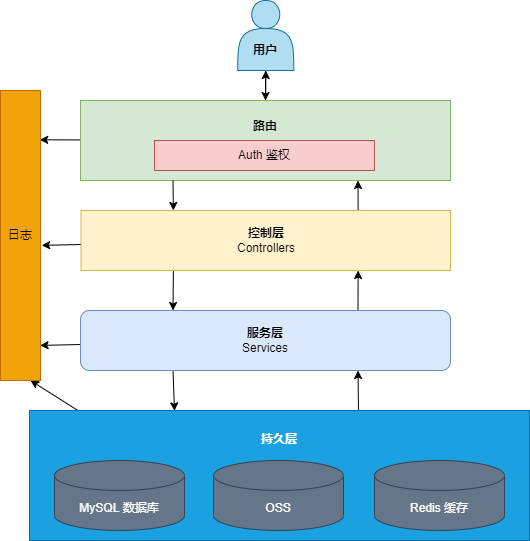

# h68u-tiktok-app
hdu-team tiktok-summer
字节跳动2022青训营后端专场 一班 h68u组

[operation]target_file_name(or module/package name):<space>operation_description

[update]/[remove]/[fix]/[feature]

  > eg feat README.md: create README.md

## 如何开始

1. 将仓库的 `main` 分支拉取到本地

   > git clone git@github.com:h68u/h68u-tiktok-app.git        // 通过 SSH [推荐]
   >
   > git clone https://github.com/h68u/h68u-tiktok-app.git  // 通过 HTTPS
   >
   > gh repo clone h68u/h68u-tiktok-app   // 通过 GitHub CLI

2. 在本地仓库建立并切换到自己的分支

   > git checkout -b 你的分支名-dev

3. 在 GitHub 上提一个 issue ，指明自己要负责的部分

4. 在本地开发，开发完成后 push 到仓库

   > git push origin 你的分支名-dev:你的分支名-dev
   
5. 在 GitHub 上提交 pull request （简称pr），确定没问题后自行 merge 或者找人 review 后 merge

   > push 后，直接登录 GitHub 应该就有提醒 `Compare and Pull Request` 直接点击即可

## 别人提交了更新，自己如何更新本地代码？

   > 假设你现在在自己的分支，你需要切换到 `main` 分支：
   >
   > git checkout main

   > 然后更新代码： 
   >
   > git pull

   > 拉取完成后切换回自己的分支（两种方式 ）：
   >
   > - git checkout 你的分支名-dev
   > - git checkout -   // 这是个英文减号 意思是切换到上一分支
   >

> 将自己的分支与主分支合并
>
> git merge main

- 注：若有分支合并时有冲突请及时沟通

## 项目分层

  

目前项目从下到上分为：

### common/

- common/config : 负责读取配置文件，也就是项目根目录下的 `app.yaml`，其格式请参考 `app.example.yaml` ，其比较详细的介绍在项目的 `doc` 文件夹中
- common/db : 封装了数据库 MySQL 和 Redis，使用时只需要 db.MySQL.Xxxx 、db.Redis.Xxxx
- common/log : 日志，应用于业务层，如何使用请参考 service/user.go
- common/model : 数据表，不一定没有问题，出了问题请用力敲打我（slime
- common/oss : oss 相关
- common/result : 封装的业务层返回响应，如何使用请参考 service/user.go

### service/

> 业务的具体逻辑与实现，db.MySQL、db.Redis 在这里按需调用

- 各个接口对应写在各个文件中，如 user 相关就写在 user.go 中

### controller/

> 对 service 层的业务逻辑进行调用，鉴权判断，根据实际情况返回数据或错误码 <--- 这个好像还没写(冒汗)

### middlewire/

> 鉴权中间件

### 其他：

- **doc/**  存放项目文档

- **api/**  业务接口的抽象，具体问 sjc （臭不要脸甩锅.jpg
- **util/** 这个 **doc/** 里写的挺详细了
- **cmd/**  存放项目的路由与启动相关，其实这就是 `main` 包所在
